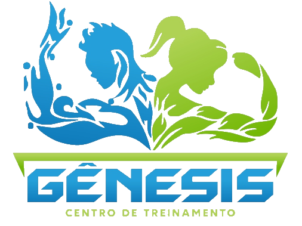

# genesis-gym

> 💪 Aplicação criada com ferramentas para a [Academia Gênesis](https://www.instagram.com/genesiscentrodetreinamento)

<div align="center">
    
</div>

## Inicialização


- Clone e acesse o repositório
  ```shell
    git clone https://github.com/swshadows/genesis-gym.git
    cd genesis-gym
  ```

- Baixe as requisições do projeto com o comando `npm install`
- Rode com `npm run dev`
